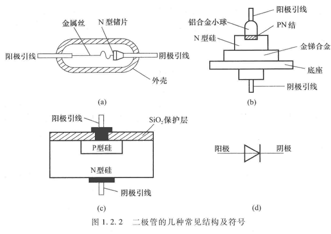
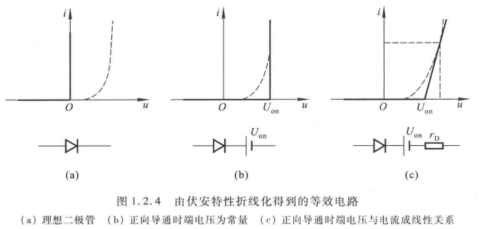

# 半导体器件

## 基础

### 半导体

* 本征半导体：纯净、晶体结构
* 载流子：空穴、自由电子
* 本征激发、复合、载流子浓度~ $ T^{\frac{2}{3}} e^{\frac{1}{T}}$（一定范围内近似按指数升高）

### PN结

* N型半导体 P型半导体 多子 少子
* 扩散运动 漂移运动（电场力作用下） 空间电荷区
* 单向导电性
* 电流方程为

$$
i = I_S (e^{\frac{qu}{kT}}-1) = I_S (e^{\frac{u}{U_T}}-1)
$$

$U_T$为电压当量

* 正向伏安特性：死区 导通电压
* 反向伏安特性：反向击穿（掺杂浓度低：雪崩击穿 高：齐纳击穿）
  温度越高，雪崩需要电压越高，齐纳越低
* 电容效应：势垒电容 扩散电容

### 半导体二极管

常见结构:

伏安特性：

1. 电流跟小（体电阻）
2. 反向电流更大

温度影响：T增，I正左移，I负下移

主要参数：

* 最大整流电流$I_F$
* 最高反向工作电压$U_R$，通常为击穿电压$U_{BR}的一半$
* 反向电流$I_R$
* 最高工作频率$f_M$

直流等效电路：

